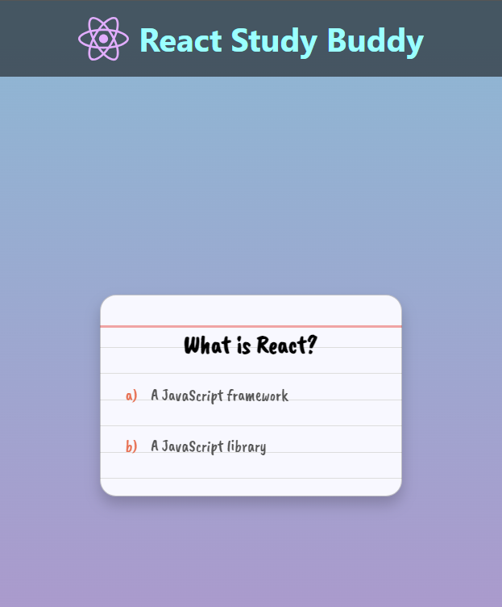
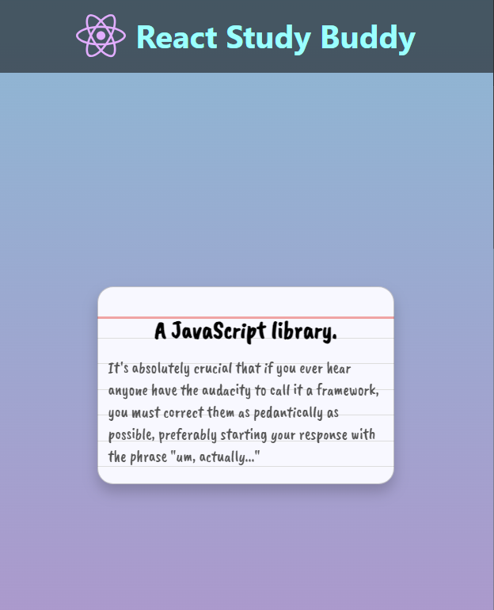

# About React

https://what-is-react.netlify.app/

---

Quick start:

```
$ npm install
$ npm start
$ npm run dev
```

```
$ pnpm install
$ pnpm start
$ pnpm run dev
```

```
$ yarn
$ yarn start
$ yarn run dev
```

Head over to https://vitejs.dev/ to learn more about using vite

-----

### What is React? 🤔

1. **_A JavaScript framework?_** 🥱🫡
2. **_A JavaScript library?_** 😁📚

> **ANSWER:** It's absolutely crucial that if you ever hear anyone have the audacity to call it a framework,
> you must correct them as pedantically as possible, preferably starting your response with the phrase "um, actually..." 🫡😁

### Screenshots





-------


## Languages and Tools are used

1. **Languages** 🗣 💡
    + [HTML](https://github.com/topics/html)
    + [HTML5](https://github.com/topics/html5)
    + [CSS](https://github.com/topics/css)
    + [CSS3](https://github.com/topics/css3)
    + [React](https://github.com/topics/react)
    + [JavaScript](https://github.com/topics/javascript)

2. **Tools** 🔨 🔧
    + [Chrome](https://github.com/topics/chrome)
    + [VSCode](https://github.com/topics/vscode)
    + [Figma](https://github.com/topics/figma)
    + [Netlify](https://github.com/topics/netlify)


------


## Cloning the project 🪛

```
# Clone this repository
$ git clone MastooraTurkmen/About-React

# Go inside the repository
$ cd about-react
```


## Deployment📥

1. How to deploy our project to the Netlify site?
2. I use [Netlify App](https://app.netlify.com/) for deploying my projects.
3. Go to the Netlify site and select Add a new site.
4. From there select **_Deploy with Github_**.
5. Then write your project name and select it.
6. After selecting here you can see that the project **_Review configuration for About-React_** and then select the **_Deploy About-React_** Button.
7. Now your project is Live.


-----


# React + Vite

This template provides a minimal setup to get React working in Vite with HMR and some ESLint rules.
Currently, two official plugins are available:
- [@vitejs/plugin-react](https://github.com/vitejs/vite-plugin-react/blob/main/packages/plugin-react/README.md) uses [Babel](https://babeljs.io/) for Fast Refresh
- [@vitejs/plugin-react-swc](https://github.com/vitejs/vite-plugin-react-swc) uses [SWC](https://swc.rs/) for Fast Refresh

## Author

***Mastoora Turkmen***